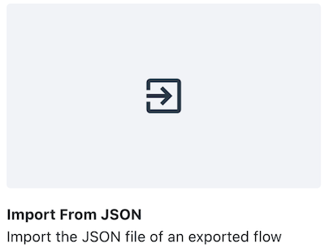
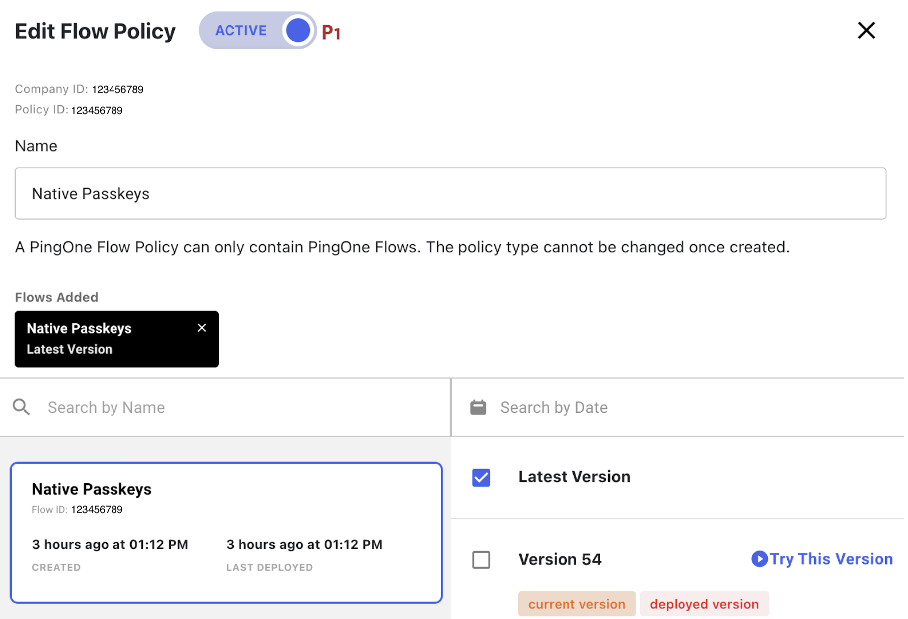

# Passkey implementation for Android mobile app with PingOne DaVinci

## Overview

This section contains information regarding passkey implementation in the PingOne MFA sample app for Android, using a DaVinci server-side solution. Passkeys provide an additional layer of security and user verification, enhancing the trustworthiness of your app. Follow these instructions to integrate passkeys into your own Android application seamlessly.

**Note**: The passkey implementation relates to the PingOne server, not the mobile SDK. The sample app demonstrates how to implement passkey usage in a native Android app.

## Prerequisites

The following are prerequisites if you want to implement passkey usage:

* Download the latest version of the sample app repository.
* Ensure Android target version is updated to API level 34 (Android 14).
* Familiarize yourself with Google's [patterns documentation](https://developer.android.com/design/ui/mobile/guides/patterns/passkeys) and [credential manager documentation](https://developer.android.com/training/sign-in/passkeys) on supporting passkeys to understand the Android side of the implementation.

## Implementation steps

<a name="davinci_setup"></a>
### 1. DaVinci setup
**Note**: If you use a different backend to implement the FIDO server calls, skip this step and go to [Asset Links file setup](#asset_links_file_setup).

#### PingOne environment
Create a PingOne environment if you don't already have one.

#### DaVinci - import flow and create an application and a policy to invoke it

1. Sign on to your PingOne account.
2. Open the DaVinci admin console: Main menu → PingOne Services → DaVinci.

    

**Note**: If you don’t see DaVinci on the menu, add it to your environment: Main Menu → Overview → add DaVinci to the list of services.

3. In DaVinci, on the Connectors tab, make sure you have `PingOne` & `PingOne MFA` connectors set up for your environment.

4. Import the Native Passkeys flow:
    1. Download the [Native_Passkeys.json](./Native_Passkeys.json) file to your computer (it is in the sample app repository).
    2. Navigate to Flows.
    3. Click Add Flow.
    4. Choose Import from JSON and select the file Native_Passkeys.json.

        

5. Create DaVinci application and policy:
    1. In DaVinci, navigate to Applications.
    2. Click Add Application and give it a name (for example, "Native Passkeys").
    3. Click the new application to edit it.
    4. Click Flow Policy → Add Flow Policy.
    5. Give the policy a name.
    6. Select the Native Passkeys flow and choose Latest Version.

        
        
    7. Click Create Flow Policy.
    8. Set the weight to 100% and click Save Flow Policy.

#### PingOne application

Create an OIDC application to run the DaVinci flow:

1. In your PingOne environment, navigate to Connections → Applications. 
2. Create an OIDC application and enable it.
3. Go to the Policies tab for the new application.
4. Click the pencil button to edit.
5. Go to the DaVinci Policies section. 
6. Select the policy you created in DaVinci (make sure it’s the only one checked).
7. Go to the Overview tab for the application and copy the Client ID. 

#### FIDO policy

1. In your PingOne environment, navigate to Experiences → Policies → FIDO 
2. You will see a FIDO policy called _Passkeys_. Make sure it is set as the default FIDO policy. Open the _Passkeys_ policy and verify that it has the following settings:
    * Relying Party ID should be set to your `domain` (the domain where you have `.well-known/assetlinks.json` and `.well-known/apple-app-site-association`).
    * Discoverable Credentials set to `Required`.
    * User Verification set to `Required`.
    * Backup Eligibility set to `Allow`.

#### Flow endpoints
The endpoints for registering and authenticating when using passkeys are as follows (replace the variables where applicable).
These endpoints always return HTTP code 200. If an error occurs, the error details are found in the response body, in `httpBody.error`.
**Note:** The URLs in the example refer to the North America geography. If your environment is in a different geography, use:

    `auth.pingone.eu` for Europe
    `auth.pingone.ca` for Canada
    `auth.pingone.ap` for Australia

#####Start username-less authentication
GET https://auth.pingone.com/{{envId}}/as/authorize?client_id={{client_id}}&scope=openid&response_type=code&response_mode=pi.flow
    
In the response, save:

    additionalProperties.publicKeyCredentialRequestOptions
    additionalProperties.deviceAuthenticationId

#####Complete the authentication and get the username
GET https://auth.pingone.com/{{envId}}/as/authorize?client_id={{client_id}}&scope=openid&response_type=code&response_mode=pi.flow&deviceAuthenticationId={{deviceAuthenticationId}}&assertion={{assertion}}&rpId={{rpId}}

In the response, get: 

    additionalProperties.username

#####Start passkeys registration
GET https://auth.pingone.com/{{envId}}/as/authorize?client_id={{client_id}}&scope=openid&response_type=code&response_mode=pi.flow&username={{username}}&password={{password}}
    
In the response, save:
 
    additionalProperties.publicKeyCredentialCreationOptions
    additionalProperties.userId
    additionalProperties.deviceId

#####Complete the registration
GET https://auth.pingone.com/{{envId}}/as/authorize?client_id={{client_id}}&scope=openid&response_type=code&response_mode=pi.flow&userId={{userId}}&deviceId={{deviceId}}&attestation={{attestation}}&rpId={{rpId}}


### 2. Get environment credentials

Next, get the values for the following credentials, referred to in the Davinci setup section:

    `environment id`
    `client id`
    `base url` (for example, `auth.pingone.com`)
    `domain`
In the sample app's `build.gradle` file, replace these placeholder credentials with the relevant values. 

**Note:** `domain` represents the relying party responsible for registering or authenticating the device. It should be your server's unique domain for this purpose.

<a name="asset_links_file_setup"></a>
### 3. Asset Links file setup

To enable passkey support for your Android app, associate your app with a website that your app owns. See Google [documentation](https://developer.android.com/training/sign-in/passkeys#add-support-dal).

### 4. Passkey flow implementation

The sample mobile app includes `PasskeysActivity.Java` to handle user-initiated sign-on actions and `PKDeviceFlowManager.Java` to manage all modal layers, including server requests and responses and passkey manager communications.

#### Authentication

```Java
private void signInPasskey(GetPublicKeyCredentialOption getPublicKeyCredentialOption) {
    // See code in the repo
}
```

#### Registration

```Java
private void signUpPasskey(String passkeyCreationRequest){
    // See code in the repo
}
```

### 5. Automatic PassKey Enrollment
Automatic passkey enrollment uses a conditional request (Android Credential Manager) to surface an "Upgrade to passkey" path with minimal user friction. Enable it by setting `IS_AUTO_ENROLLMENT_ENABLED = true` in `build.gradle`; the logic is contained in `PKDeviceFlowManager`.

The automatic upgrade is shown only if the user already has a saved username and password credential in a supporting credential provider (credential provider that currently supports automatic passkeys, for example, Google's credential provider). When those prerequisites are met, Android can present a conditional UI allowing the user to create a passkey without first re‑entering their password.

#### Preconditions
* User has previously registered or signed in with a username + password.
* That password credential was saved by the credential provider (user accepted the save prompt).
* The credential provider supports passkey auto‑upgrade (beta; not universal yet).

## Disclaimer

THE SAMPLE CODE IS PROVIDED "AS IS", WITHOUT WARRANTY OF ANY KIND, EXPRESS OR IMPLIED, INCLUDING BUT NOT LIMITED TO THE WARRANTIES OF MERCHANTABILITY, FITNESS FOR A PARTICULAR PURPOSE AND NONINFRINGEMENT. IN NO EVENT SHALL THE AUTHORS OR COPYRIGHT HOLDERS BE LIABLE FOR ANY CLAIM, DAMAGES OR OTHER LIABILITY, WHETHER IN AN ACTION OF CONTRACT, TORT OR OTHERWISE, ARISING FROM, OUT OF OR IN CONNECTION WITH THE SAMPLE CODE OR THE USE OR OTHER DEALINGS IN THE SAMPLE CODE.  FURTHERMORE, THIS SAMPLE CODE IS NOT COMMERCIALLY SUPPORTED BY PING IDENTITY BUT QUESTIONS MAY BE ADDRESSED TO PING'S SUPPORT CENTER OR MAY BE OTHERWISE ADDRESSED IN THE RELATED DOCUMENTATION.

Any questions or issues should go to the support center, or may be discussed in the [Ping Identity developer communities](https://support.pingidentity.com/s/topic/0TO1W000000atTxWAI/pingone-mfa).
